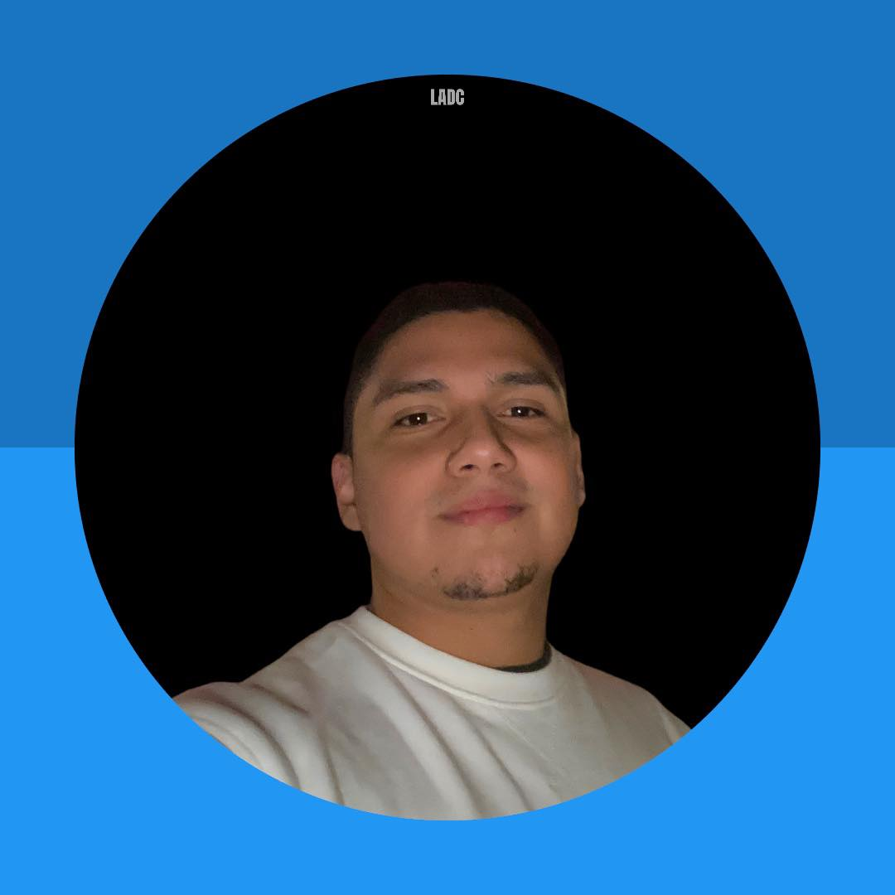

<h3 style="text-align: center;">Curriculum Vitae</h3>

  

    
    

      <h4><b>Andres Davalos</b></h4> 
      
Embedded software developer
 
    

  

  

    

      <h4><b>Jane Doe</b></h4> 
      
Interior Designer
 
    

  

  

  # Persoonlijk profiel

In 2022 heb ik mijn studie afgerond en ben ik vervolgens een schakeljaar aan de UA gaan volgen. Tijdens dit jaar heb ik echter ontdekt dat mijn ware interesse ligt in het daadwerkelijk toepassen van mijn kennis in de praktijk en het starten van een professionele carrière. Mijn enthousiasme voor de nieuwste software- en hardwaretechnologieën blijkt zowel uit mijn zelfstandige als teamgerichte bijdragen aan diverse projecten. Ik ben een uiterst gemotiveerde student die zich openstelt voor nieuwe ervaringen en altijd bereid is om bij te leren.
Naast mijn academische bezigheden heb ik me intensief beziggehouden met zowel hardware- als software-DIY-projecten. Het streven naar continue zelfontwikkeling en het toepassen van creatieve oplossingen hebben mij hierbij gemotiveerd. Om zowel mentaal als fysiek in balans te blijven, beoefen ik sport regelmatig, doorgaans 2 tot 3 keer per week. Ik ben nu klaar om mijn opgedane kennis en ervaringen toe te passen in een professionele omgeving en een succesvolle carrière te starten.

